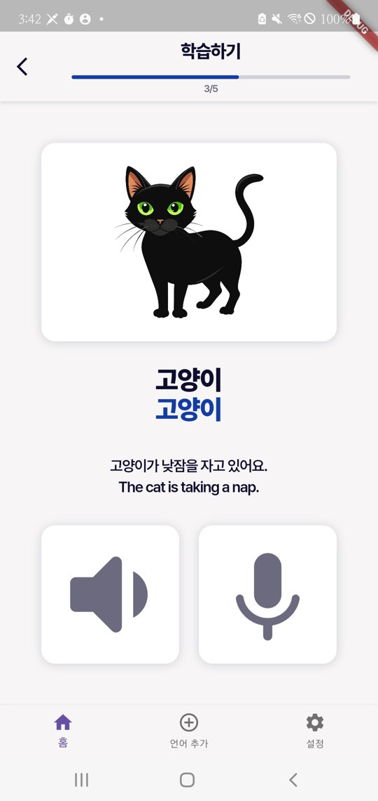
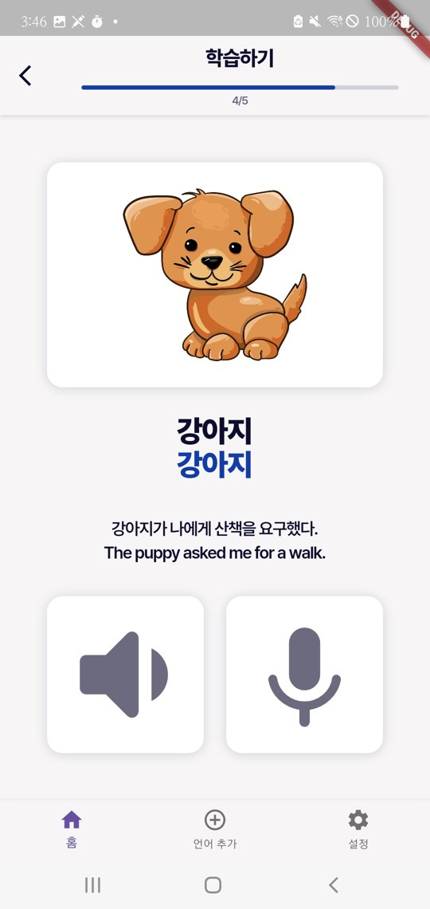
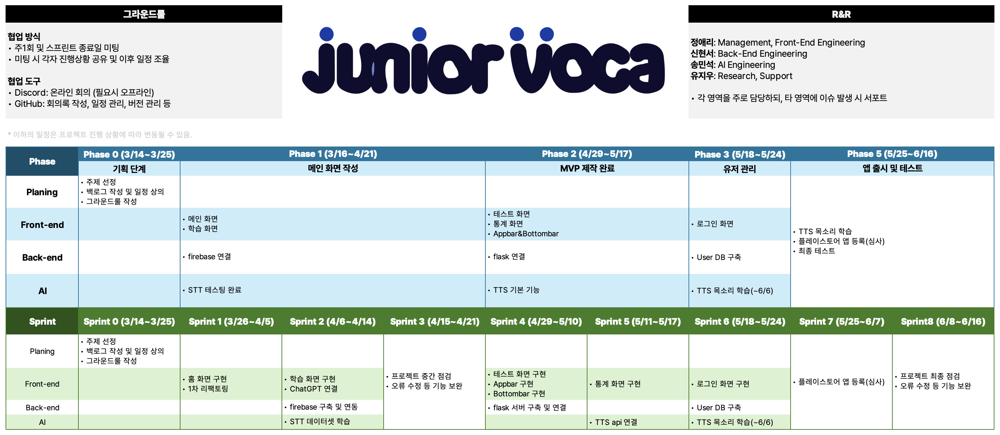
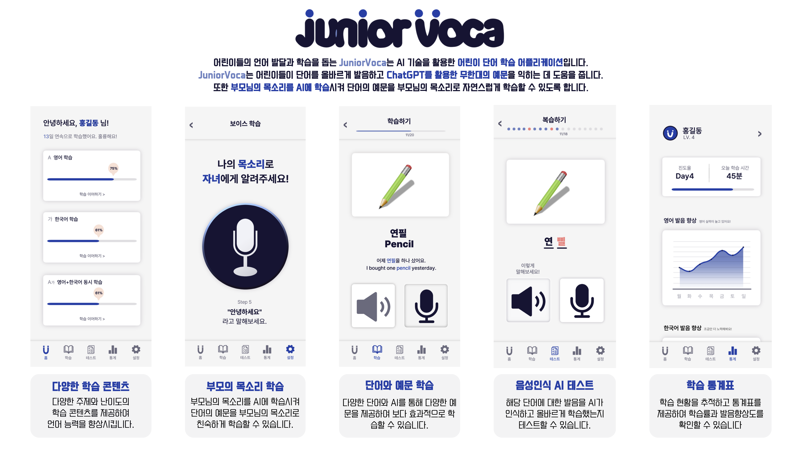

<p align="center">
  
</p>

# JuniorVoca

> **ChatGPT를 활용한 아동용 단어 학습 애플리케이션**

어린이가 단어를 익히고, 생성형 AI가 만든 예문으로 쓰임새를 배우고, 직접 발음해 보며 학습하는 Flutter 앱입니다.

- 2024-1학기 캡스톤디자인 (대전대학교 정보보안학과)
- 기간: 2024.03 ~ 2024.06
- 4인 팀

## 배경

디지털 기기로 공부하는 어린이가 늘었지만, 단어 앱 대부분은 정해진 예문을 반복해서 보여주는 데 그칩니다.
JuniorVoca는 **ChatGPT로 단어마다 새로운 예문을 만들고**, **아이가 직접 발음한 음성을 인식**해 학습을 이어가도록 설계했습니다.
아이가 혼자서도 쓸 수 있도록 한 화면의 정보와 조작 단계를 줄이고, 단어 확인부터 발음 녹음까지 한 화면에서 이어지게 구성했습니다.

## 실행 화면

<p align="center">
  
  &nbsp;&nbsp;
  
</p>
<p align="center"><sub>실제 기기 실행 화면: 단어 카드, ChatGPT로 생성한 예문, 녹음 재생·녹음 버튼</sub></p>

## 주요 기능

| 기능 | 설명 |
|---|---|
| 단어 카드 학습 | 이미지 카드를 넘기며 단어와 뜻 학습 (현재 1일차 단어 세트) |
| AI 예문 생성 | ChatGPT API로 단어마다 짧은 한국어·영어 예문 생성 |
| 발음 녹음·재생 | 아이가 단어를 직접 발음해 녹음하고 다시 들어보기 |
| 음성 인식 | 녹음 파일을 서버로 보내 음성 인식(STT) 결과를 화면에 표시 |

> 메인 화면의 학습 진도율과 학습 메뉴(부모 목소리 학습, 음성인식 AI 테스트 등)는 화면 UI만 구성되어 있고, 기능은 아직 연결되지 않았습니다.

## 동작 흐름

### 예문 생성

```
[단어 카드] ──▶ ChatGPT API 요청 ──▶ 응답 200? ──Yes──▶ 예문 표시
                                       │
                                       No
                                       ▼
                           대기 후 재시도 (Exponential Backoff)
```

- 한국어 기준 6단어 이내의 완결된 문장만 생성하도록 프롬프트에 제약과 예시를 넣었습니다.
- 외부 API는 일시적으로 실패할 수 있으므로, 실패 시 오류 화면 대신 **2초에서 시작해 대기 시간을 2배씩 늘리며 최대 5회 재시도**합니다. 재시도하는 동안 화면은 로딩 상태를 유지합니다.

### 음성 인식

```
[마이크 버튼] ──▶ 권한 확인 ──▶ 녹음 ──▶ 서버 업로드 ──▶ 음성 인식(Whisper) ──▶ 결과 표시
```

- 기기 환경에 따라 녹음 코덱을 `aacMP4`에서 `opusWebM`으로 전환합니다.

## 기술 스택

| 영역 | 기술 |
|---|---|
| App | Flutter, Dart, flutter_sound, permission_handler, http, flutter_dotenv |
| AI | OpenAI ChatGPT API (gpt-3.5-turbo), OpenAI Whisper (STT) |
| Server | Flask, Firebase |
| 협업 | GitHub (Issue, PR, 커밋 템플릿), Discord |

## 프로젝트 구조

```
lib/
├── main.dart
├── screens/
│   ├── home_page.dart          # 메인 화면 (진도율)
│   └── learning_page.dart      # 단어 카드 학습 화면
├── utils/
│   ├── chatgpt_service.dart    # ChatGPT 예문 생성 + 재시도
│   └── simple_recorder.dart    # 녹음·재생, 서버 업로드
├── widgets/                    # AppBar, BottomNavBar, 카드 등 공통 위젯
└── styles/                     # 색상, 테마
assets/
├── words/day1.json             # 일차별 단어 데이터
├── images/                     # 단어 카드 이미지
└── fonts/                      # Pretendard
```

## 시작하기

### 1. 환경 변수

프로젝트 루트에 `.env` 파일을 만들고 아래 내용을 작성합니다.

```env
IP_ADDRESS=<STT_SERVER_IP>
OPENAI_APIKEY=<YOUR_OPENAI_API_KEY>
```

### 2. 실행

```bash
flutter pub get
flutter run
```

- 음성 인식을 쓰려면 STT 서버가 `http://<IP_ADDRESS>:5001`에서 실행 중이어야 합니다.
- 마이크 권한이 필요합니다.

## 팀 구성

| 팀원 | 역할 |
|---|---|
| [정애리](https://github.com/aeri123443) | Management, Front-End Engineering |
| [신현서](https://github.com/Leafxi) | Back-End Engineering |
| 송민석 | AI Engineering |
| 유지우 | Research, Support |

### 협업 방식

- 주 1회 및 스프린트 종료일 미팅으로 진행 상황 공유와 일정 조율
- Phase 0-5, Sprint 0-8 단위 일정 관리
- 브랜치 전략(`타입/기능/작성자`), 커밋 템플릿(`commit-template.txt`), Issue·PR 기반 작업

<details>
<summary>그라운드룰 · R&R · 일정표</summary>



</details>

## 향후 계획

기획 단계에서는 아래 기능까지 설계했으나, 학기 내에 구현하지 못했습니다.

- 부모님 목소리를 학습한 TTS로 예문 읽어주기
- 발음 테스트 화면과 학습 통계 화면
- 학습 진도율 실제 데이터 연동
- 로그인, 사용자 계정 및 학습 기록 DB
- 플레이스토어 출시

<details>
<summary>기획 스토리보드 (설계안)</summary>



</details>
